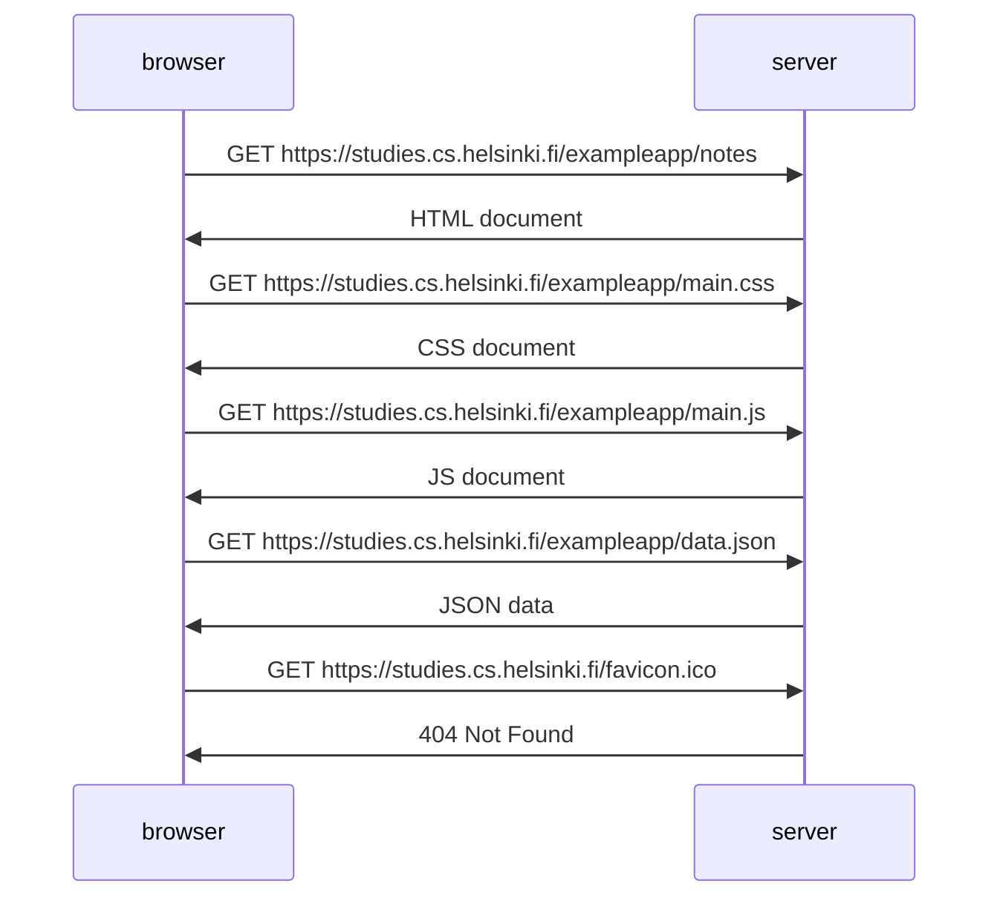

# 0.4: Nuevo diagrama de nota

https://studies.cs.helsinki.fi/exampleapp/notes

sequenceDiagram
    participant browser
    participant server

    browser >>> server : GET https://studies.cs.helsinki.fi/exampleapp/notes
        Estado 200 OK
    activate server
    server >>> browser : HTML document
    deactivate server

    browser >>> server : GET https://studies.cs.helsinki.fi/exampleapp/main.css
        Estado 200 OK
    activate server
    server >>> browser : CSS document
    deactivate server

    browser >>> server : GET https://studies.cs.helsinki.fi/exampleapp/main.js
        Estado 200 OK
    activate server
    server >>> browser : JS document
    deactivate server

    browser >>> server : GET https://studies.cs.helsinki.fi/exampleapp/data.json
        Estado 200 OK
    activate server
    server >>> browser : JSON data
    deactivate server    

    browser >>> server : GET https://studies.cs.helsinki.fi/favicon.ico
        Estado 404 Not Found
    activate server
    server >>> browser : 404 Not Found
    deactivate server

