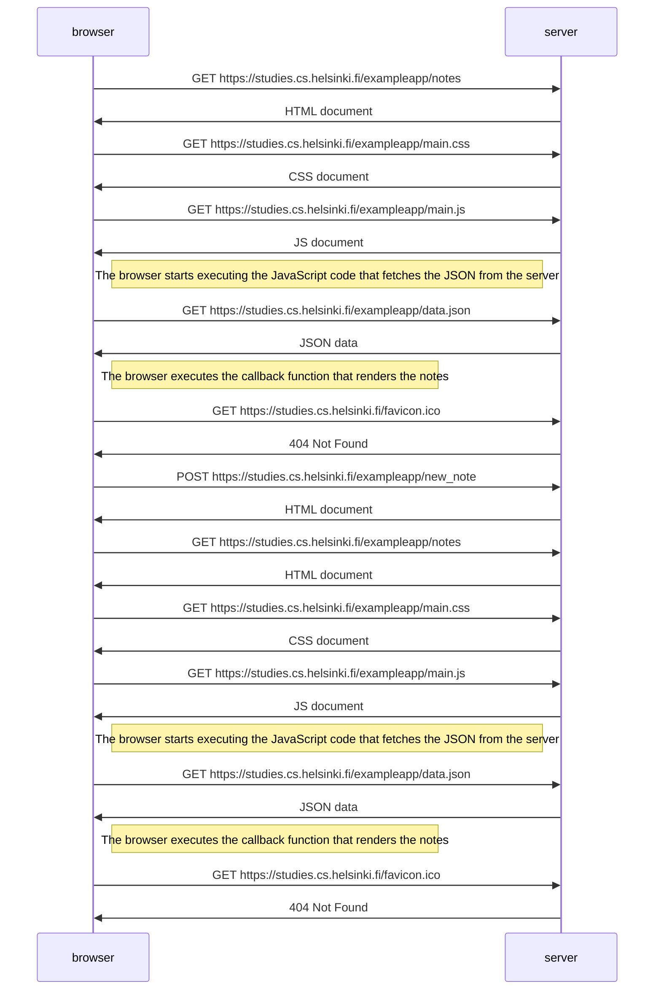

# 0.4: Nuevo diagrama de nota

https://studies.cs.helsinki.fi/exampleapp/notes

    sequenceDiagram
        participant browser
        participant server    
    browser->>server: GET https://studies.cs.helsinki.fi/exampleapp/notes                    
    server->>browser: HTML document            
    browser->>server: GET https://studies.cs.helsinki.fi/exampleapp/main.css
    server->>browser: CSS document    
    browser->>server: GET https://studies.cs.helsinki.fi/exampleapp/main.js
    server->>browser: JS document
    browser->>server: GET https://studies.cs.helsinki.fi/exampleapp/data.json
    server->>browser: JSON data
    browser->>server: GET https://studies.cs.helsinki.fi/favicon.ico
    server->>browser: 404 Not Found
    browser->>server: POST https://studies.cs.helsinki.fi/exampleapp/new_note
    server->>browser: HTML document
    browser->>server: GET https://studies.cs.helsinki.fi/exampleapp/notes
    server->>browser: HTML document
    browser->>server: GET https://studies.cs.helsinki.fi/exampleapp/main.css
    server->>browser: CSS document    
    browser->>server: GET https://studies.cs.helsinki.fi/exampleapp/main.js
    server->>browser: JS document
    browser->>server: GET https://studies.cs.helsinki.fi/exampleapp/data.json
    server->>browser: JSON data
    browser->>server: GET https://studies.cs.helsinki.fi/favicon.ico
    server->>browser: 404 Not Found

